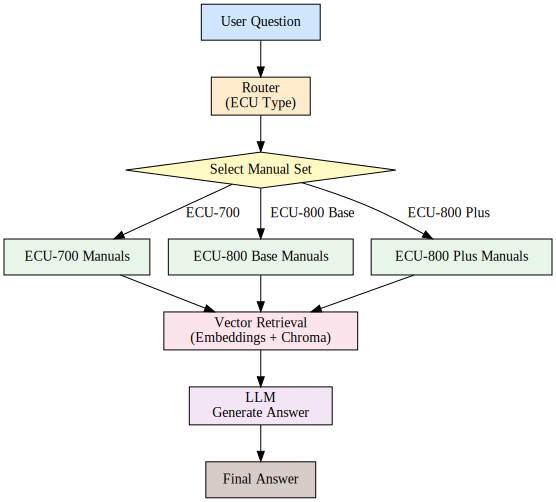

# ME Engineering Assistant

A production-ready **Retrieval-Augmented Generation (RAG)** system that answers engineering questions using ECU (Electronic Control Unit) technical manuals.

This project demonstrates:
- Local LLM inference (Phi-3 Mini, offline)
- Remote LLM inference (HuggingFace Inference API, configurable)
- Multi-document RAG
- Query routing across multiple ECU models
- FastAPI RESTful service
- MLflow model packaging & serving
- Dockerized API serving (validated; supports .env configuration)

The system can run fully offline when using the local backend, making it suitable for on-premise or restricted environments.
When configured with the remote backend, it can trade offline capability for potentially lower latency (network permitting).

---

## 🔍 1. Overview

Modern engineering teams often rely on large, unstructured PDF/manual collections.  
**ME Engineering Assistant** turns ECU manuals into an intelligent Q&A assistant powered by:

- Embedding-based retrieval  
- Query routing  
- Lightweight local LLM reasoning  

The system supports the following manuals:

- ECU-700 Series
- ECU-800 Base
- ECU-800 Plus

Routing ensures each query is answered using the most relevant manual family.

---

## ✨ 2. Key Features

### ✔ Multi-manual RAG  
Automatically routes each question to the correct ECU manual family using rule-based classification.

### ✔ Local Phi-3 LLM  
Runs fully offline using `microsoft/Phi-3-mini-4k-instruct` with automatic device selection (MPS/CUDA/CPU) and a fast default dtype (FP16 on MPS).

### ✔ Remote open-source LLM (HuggingFace Inference API)
Supports a remote backend via environment configuration (e.g., `LLM_BACKEND=remote`) so the same pipeline can run either
offline (local) or over the network (remote) without code changes.

### ✔ Efficient Vector Search  
Uses HuggingFace embeddings + Chroma vectorstore for high-recall context retrieval, with on-disk persistence to avoid re-embedding across restarts.  
<br>Tip: the persisted Chroma index defaults to `<project_root>/.chroma`. Keeping this cache between runs can significantly reduce
end-to-end latency for the local backend by avoiding repeated embedding + indexing work.

### ✔ Modular LangGraph Workflow  
Separates concerns: routing → retrieval → answer generation.

### ✔ MLflow Model Packaging  
Exports the entire pipeline as a custom pyfunc model with versioning + prod alias.

### ✔ REST API with FastAPI  
Provides a standard /predict endpoint.

### ✔ Docker (Validated)
Runs as a self-contained HTTP API with a single command using `--env-file .env`.
No need to manually locate MLflow artifact paths.

---

## 📂 3. Repository Structure

```text
me-engineering-assistant/
│
├── README.md                      # Project documentation
├── pyproject.toml                 # Dependencies & build config
├── Dockerfile                     # Docker build instructions (validated; .env-friendly)
├── project_tree.txt               # Auto-generated project structure
├── .env.example                   # Environment template (no secrets)
├── .gitignore                     # Ignore local artifacts & secrets
│
├── data/                          # ECU manuals + test questions
│   ├── ECU-700_Series_Manual.md
│   ├── ECU-800_Series_Base.md
│   ├── ECU-800_Series_Plus.md
│   └── test-questions.csv
│
├── saved_model/                   # Exported MLflow pyfunc artifacts (generated, gitignored)
│   └── ... (latest model artifacts; used by Docker as /app/saved_model)
│
├── mlruns/                        # Local MLflow tracking directory (generated, gitignored)
│   └── ... (local runs / registry metadata; optional for end users)
│
├── .chroma/                       # (Generated) persisted Chroma indexes for faster restarts (gitignored)
│
├── src/
│   └── me_engineering_assistant/
│       ├── __init__.py
│       ├── __main__.py            # FastAPI entrypoint (auto-detects MODEL_URI)
│       ├── api.py                 # REST handlers
│       ├── config.py              # Robust data path resolution (local + Docker)
│       ├── data_loader.py
│       ├── graph.py               # LangGraph orchestration (router → RAG)
│       ├── log_model.py           # MLflow logging + export to ./saved_model
│       ├── mlflow_model.py        # MLflow pyfunc interface
│       ├── rag_chain.py           # Retrieval + LLM generation
│       ├── router.py              # Document routing logic
│       ├── sandbox_test.py        # Simple local CLI test
│       └── vectorstore.py         # Embeddings + vectorstore builder
│
└── tests/
    ├── benchmark.py               # Benchmark verification
    └── test_agent_e2e.py          # End-to-end verification
```

---


## 🧠 4. System Architecture



---

## ⚙️ 5. Installation

### 5.1 Clone the repository

```bash
git clone <repo-url>
cd me-engineering-assistant
```

### 5.2 Create a Python 3.11 virtual environment

```bash
python3.11 -m venv .venv
source .venv/bin/activate
```

### 5.3 Install dependencies

```bash
pip install .
```

For development mode:
```bash
pip install -e .
```

---

## 🚀 6. Running Locally (CLI)

### 6.1 Local Phi-3 (offline)

First run (build vector index once):
```bash
export LLM_BACKEND=local
export LLM_MODEL_NAME="microsoft/Phi-3-mini-4k-instruct"
export RAG_REBUILD_INDEX=1
python -m me_engineering_assistant.sandbox_test
```

Subsequent runs (reuse the persisted index):
```bash
export LLM_BACKEND=local
export RAG_REBUILD_INDEX=0
python -m me_engineering_assistant.sandbox_test
```

### 6.2 Remote open-source LLM (HuggingFace Inference API)

Create `.env` from the template:

    cp .env.example .env

Edit `.env` and set:

    LLM_BACKEND=remote
    REMOTE_LLM_MODEL_NAME=meta-llama/Llama-3.2-1B-Instruct
    HUGGINGFACEHUB_API_TOKEN=hf_xxx

Then run:

```bash
python -m me_engineering_assistant.sandbox_test
```

The project autoloads `.env` via `python-dotenv`.

All entrypoints (CLI, FastAPI, MLflow logging) obey these settings.

### 6.3 Configuration reference (env vars)

- `ME_ASSISTANT_CHROMA_DIR`: directory for persisted Chroma indexes (default: `<project_root>/.chroma`)
- `RAG_REBUILD_INDEX=1`: force rebuild of the vector index (use after changing manuals or chunking params)
- `RAG_CHUNK_SIZE`, `RAG_CHUNK_OVERLAP`, `RAG_TOP_K`: retrieval parameters
- `RAG_MAX_CONTEXT_DOCS`, `RAG_MAX_CONTEXT_CHARS_TOTAL`, `RAG_MAX_CONTEXT_CHARS_PER_DOC`: prompt caps for latency control
- `LLM_MAX_NEW_TOKENS`: generation cap (latency control)
- `TORCH_NUM_THREADS`: optional CPU thread cap for more predictable latency

---

## 🚀 7. MLflow Model Logging
Before serving the API, you must register the MLflow model.

### 7.1 Set tracking URI
```bash
export MLFLOW_TRACKING_URI="file:$(pwd)/mlruns"
```
### 7.2 Log the model
```bash
python -m me_engineering_assistant.log_model
```
This will:
- Run the complete pipeline (routing → RAG → LLM)
- Log a new MLflow model version
- Update the prod alias

Example output:
```vbnet
Question: What is the maximum operating temperature for the ECU-850b?
Answer: The maximum operating temperature for the ECU-850b is +105°C.
```

Additionally, the script exports the latest model artifacts to:

    ./saved_model/

This fixed path is used by Docker to avoid manual MLflow artifact path lookup.

Optional (Model Registry alias, local usage only):

    models:/me-engineering-assistant@prod

## 🌐 8. Start the FastAPI Server

```bash
python -m me_engineering_assistant
```
The server will start at:
```bash
http://localhost:8000/predict
```

---

## 📡 9. Example API Requests

### 9.1 cURL

```bash
curl -X POST http://localhost:8000/predict \
     -H "Content-Type: application/json" \
     -d '{"questions": ["What is the maximum operating temperature of the ECU-850b?"]}'
```

### 9.2 Python

```python
import requests

resp = requests.post(
    "http://localhost:8000/predict",
    json={"questions": ["What is the maximum operating temperature of the ECU-850b?"]}
)
print(resp.json())
```

### 9.3 Postman

* POST ```http://localhost:8000/predict```
* Body (JSON)
```json
{
  "questions": ["What is the maximum operating temperature of the ECU-850b?"]
}
```

---

## 🧪 10. Testing & Validation Strategy

This project uses a two-layer testing strategy to validate both functionality and real-world performance of the agent.

### 10.1 Functional Testing (Pytest)

A streamlined end-to-end test (`tests/test_agent_e2e.py`) verifies that the agent can correctly answer the majority of questions in `test-questions.csv`.

The test performs the following:

- Loads all evaluation questions from the CSV file  
- Runs the complete agent pipeline (routing → retrieval → Phi-3 generation)  
- Records per-query latency  
- Counts how many answers are non-fallback responses  
- Ensures **at least 80% answer accuracy**, as required by the challenge

Run the test:
```bash
pytest -q -s
```

Sample output:
```bash
=== ME Engineering Assistant: E2E Benchmark ===
01. [OK ] 4.93s - What is the maximum operating temperature for the ECU-750?
...
Summary:
- Questions      : 10
- Answered       : 10 (100%)
- Avg time / q   : 12.91s
- Max time / q   : 29.23s
```
This confirms both correctness and overall stability of the RAG + LLM pipeline.

### 10.2 Performance & Answer Inspection (Benchmark Script)

A dedicated benchmark script is provided for detailed inspection of:

- The exact answer returned for each question
- End-to-end latency per query
- Overall accuracy
- Expected-answer grading (per-question + aggregated)
- Totals and summary metrics

Run the benchmark:
```bash
python -m tests.benchmark
```

Example output:
```bash
01. [OK ] 4.82s | score=1.00
    Q: How much RAM does the ECU-850 have?
    A: The ECU-850 has 2 GB of LPDDR4 RAM.
...
Summary:
- Questions         : 10
- OK                : 10 (100%)
- Partial           : 0 (0%)
- Miss              : 0 (0%)
- Avg time / q      : 9.10s
- Max time / q      : 37.34s
- Total runtime     : 90.98s
```
This script is intended for performance reporting and answer-quality inspection, and is not part of the automated pytest suite.  
For the exact grading rules (e.g., partial credit), see the benchmark implementation in `tests/benchmark.py`.

### 10.3 Validation Criteria

The agent is considered valid when:

- ≥ 80% of questions receive a non-fallback answer (functional correctness)
- Average latency remains within practical limits for local Phi-3 inference
- No runtime errors occur across the full question set

---

## 11. Code Quality Checks

This repository is designed to pass the basic quality requirement from the challenge:
+**pylint score > 85%**.

Run:
```bash
pylint src/me_engineering_assistant
```

Current result (example):
```text
Your code has been rated at 9.71/10
```

---

## 🐳 12. Containerization (Docker)

A Dockerfile is included to serve the agent as an HTTP API.
The container can serve the agent using either LLM backend:

- Local: Phi-3-mini model loaded via transformers
- Remote: Llama-3.x hosted on HuggingFace Inference API (free tier compatible)

### 12.1 Build image

> Make sure you have already logged a model locally (see section **7. MLflow Model Logging**)
> so that the `mlruns/` directory contains the latest artifacts.

Example usage:
```bash
docker build -t me-assistant .
```

The Dockerfile copies the following into the image:

- src/ → installed as a Python package
- data/ → /app/data
- saved_model/ → /app/saved_model

### 12.2 Prepare environment variables

Copy the template and fill in your HuggingFace token:

    cp .env.example .env

### 12.3 Run container (one-liner)

    docker run --env-file .env -p 8000:8000 me-assistant

Notes:

- `MODEL_URI` is auto-detected inside Docker (`/app/saved_model`).
- ECU manuals are loaded from `/app/data`.
- API endpoint: http://localhost:8000/predict


---

## ⚠️ 13. Limitations

### LLM-related

- Local backend (Phi-3)
  - Fully offline, but latency depends on hardware (CPU vs MPS/CUDA) and prompt length.
  - The first request can be slower due to model warm-up.

- Remote backend (Llama-3.x)
  - Often lower latency, but depends on network and provider rate limits/availability.

### Retrieval / indexing

- Vector search uses a persisted Chroma index on disk; the **first build** may take longer.
- If you change manuals or chunking parameters, rebuild the index with `RAG_REBUILD_INDEX=1`.

### System limitations

- Router is rule-based (no embedding-based classifier yet).
- No streaming responses.
- Remote backend adds an external dependency (network + HF API availability).

---

## 🚧 14. Future Work

### MLOps Enhancements

- MLflow-native model serving (mlflow models serve)
- Cloud-ready tracking server (SQLite / Postgres)
- GPU-enabled images for faster local inference

### Agent Improvements

- Embedding-based router classifier
- Human-in-the-loop validation
- Multi-step reasoning with tool use
- Support more ECU manual families

### Retrieval Performance

- Optional reranking (cross-encoder) for higher precision
- FAISS/ANN alternative index for faster retrieval at scale
- Quantized Phi-3 / llama.cpp backend for faster local inference

---

## 🏁 15. Challenge Requirements Alignment

| Requirement                 | Status                                       |     |
|-----------------------------|----------------------------------------------|-----|
| Multi-source RAG            | ✔ Implemented                                |     |
| Intelligent routing         | ✔ Router node                                |     |
| LangGraph agent             | ✔ Two-node workflow (router → RAG)           |     |
| MLflow model logging        | ✔ Custom pyfunc, versioned, prod alias       |     |
| REST API                    | ✔ FastAPI `/predict` loading MLflow model    |     |
| Dockerization               | ✔ Validated for remote backend               |     |
| Local LLM inference         | ✔ Phi-3-mini (offline)                       |     |
| Online LLM inference        | ✔ Llama-3.x via HuggingFace API (free)       |     |
| Backend configurability     | ✔ `LLM_BACKEND=local` / `LLM_BACKEND=remote` |     |
| Architectural documentation | ✔ Included                                   |     |
| Testing strategy            | ✔ Local + Remote benchmarks & pytest         |     |
| Limitations & future work   | ✔ Documented                                 |     |


---

## 🙌 Acknowledgements

- Microsoft Phi-3 Model
- meta-llama/Llama-3.2-1B-Instruct
- LangChain / LangGraph
- MLflow
- Docker
- ChromaDB